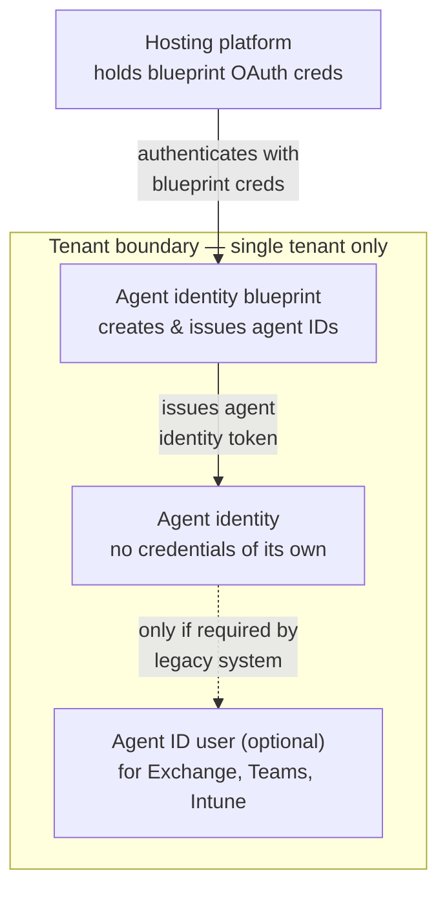

# Microsoft Entra Agent ID

## Table of Contents

- [What Problem Is This Solving?](#what-problem-is-this-solving)
- [Why Agent ID Exists: Benefits and Use Cases](#why-agent-id-exists-benefits-and-use-cases)
  - [Traditional Approaches and Where They Break](#traditional-approaches-and-where-they-break)
  - [Benefits of Agent ID](#benefits-of-agent-id)
  - [Common Use Cases](#common-use-cases)
- [The Two Core Objects](#the-two-core-objects)
- [Trust Chain — How Authentication Actually Flows](#trust-chain--how-authentication-actually-flows)
- [Full Comparison: User vs Service Principal vs Managed Identity vs Agent Identity](#full-comparison-user-vs-service-principal-vs-managed-identity-vs-agent-identity)
- [Agent Identity Blueprints](#agent-identity-blueprints)
- [Where Agents Actually Live (Registries)](#where-agents-actually-live-registries)
- [Types of Agents — Authorization Model](#types-of-agents--authorization-model)
- [Agent ID Portal — What Admins See](#agent-id-portal--what-admins-see)
- [TL;DR for the README](#tldr-for-the-readme)

---

## What Problem Is This Solving?

Before Agent ID, an AI agent's identity in Entra had to be bolted onto existing object types — usually a **Service Principal** (via an App Registration) or, in hacky cases, a real **User account** created just so an agent could have a mailbox or sign in to Teams.

Both approaches were wrong-shaped for the job:

- **App Registration / Service Principal** → fine for "an application calling an API," but never designed for "something that acts semi-autonomously on a schedule, makes decisions, and might need to look like a user to legacy systems."
- **A fake user account** → gets you into Exchange/Teams/Intune, but now you're governing an AI workload with the same lifecycle tooling you use for humans, which is a mess for access reviews, conditional access, and audit.

**Agent ID is Microsoft creating a fourth identity category** — distinct from Users, Service Principals, and Managed Identities — purpose-built so admins can govern AI agents with their own policies instead of overloading existing object types.

---

## Why Agent ID Exists: Benefits and Use Cases

### Traditional Approaches and Where They Break

Before Agent ID, teams stitched together AI agent identity from objects that weren't built for it:

| Traditional approach | What it gets you | Where it breaks down |
|---|---|---|
| **App Registration / Service Principal** | Standard auth, API access, familiar governance tooling | No native "act as user" story without manual OBO config; secrets/certs need rotation and can leak; nothing distinguishes "this SP is an AI agent" from "this SP is a normal app" — same risk tier, same blind spot |
| **Fake user account created for the agent** | Gets into Exchange/Teams/Intune, looks "normal" to legacy systems | Now governed by human-lifecycle tooling — access reviews, conditional access policies, and license assignments built for people, not workloads. Shows up in user counts, breaks per-user licensing assumptions, and an offboarding script built for humans may not know to catch it |
| **Managed Identity** | No credentials to manage, platform-rotated | Tightly bound to a single Azure resource; can't act as a user/actor in a delegated flow; doesn't generalize to non-Azure-hosted agents |
| **Ad hoc combination of the above** | "Works" | No unified inventory — you end up hunting across App Registrations, fake users, and Managed Identities just to answer "what AI agents exist in this tenant?" |

The common thread: **every traditional option forces an AI agent to pretend to be something it isn't** — either a human or a generic application — which means it inherits that thing's governance model whether or not it fits.

### Benefits of Agent ID

- **Dedicated governance surface** — agents get their own portal, their own lifecycle, their own policies, instead of hiding inside user or app counts where they're invisible to standard reviews.
- **No standing credentials to steal** — the Agent Identity itself never holds a secret; compromising it requires compromising the hosting platform's Blueprint trust chain, not just finding a leaked client secret.
- **Clean actor/subject separation** — the `azp`/actor claim cleanly distinguishes "the agent acted for itself" from "the agent acted for a user," which is exactly the distinction you need for an accurate audit trail and isn't reliably available from a bare Service Principal.
- **Tenant isolation enforced by design** — Agent Identities cannot get cross-tenant tokens at all, removing a whole class of multi-tenant app misconfiguration risk.
- **Built-in orphan/shadow detection** — the Agent ID Portal's Unmanaged Agents and No Identities tiles, plus EAR's tenant scanning, give you a standing inventory check that doesn't exist for "fake user" or ad hoc SP approaches.
- **Supports both delegated and autonomous patterns natively** — Interactive (user-delegated), Autonomous, and Instantiated agent types are first-class concepts instead of something you bolt onto OAuth scopes after the fact.
- **Legacy compatibility without full user overhead** — the optional Agent ID User gives you the mailbox/Teams/Intune access you'd otherwise fake with a real user account, but it's explicitly tied to and governed through the parent Agent Identity rather than living as an independent, easy-to-forget user object.

### Common Use Cases

- **SOC/IR automation agents** — an agent that autonomously queries logs, correlates alerts, and opens tickets fits the Autonomous pattern: its own grant, no human in the loop, clean separation from any analyst's personal permissions.
- **Copilot-style assistants acting for a user** — "summarize my inbox and draft a reply" is the Interactive pattern: the agent acts as the user, using the user's own permissions, with the actor claim recording that the agent was the one driving.
- **Scheduled compliance/posture-monitoring agents** — a continuously-running checker (conceptually similar to what your CrowdStrike CSPM integration does) maps to the Instantiated pattern: provisioned access, running on its own schedule, no per-action approval.
- **Agent-to-agent orchestration** — one agent calling another (a planner agent dispatching to a specialist agent) uses the "incoming token" pattern, where the receiving Agent Identity is the audience and can authenticate the calling agent.
- **Agents that need a mailbox or Teams presence** — e.g., a triage agent that needs to send/receive email or post in a Teams channel — this is exactly what the Agent ID User object exists for, without making the agent a full standing user account in HR/license systems.

---

## The Two Core Objects

### 1. Agent Identity (the primary account)

This is the actual identity the agent authenticates as. Key properties:

| Property | Detail |
|---|---|
| Identifiers | Object ID and App ID — **always identical** (this is new; SPs normally have different object IDs per tenant from a shared App ID) |
| Credentials | **None.** No password, no client secret, no cert directly on the object |
| How it authenticates | By presenting a token issued to the *platform/service hosting it* — auth is delegated up to the Blueprint |
| Tenant scope | Can only get tokens in the tenant where it was created — no cross-tenant tokens, period |

Three token patterns it can be involved in:

- **Agent token** — Agent Identity is the *subject*. Pure machine-to-machine, like a Service Principal calling Graph.
- **Incoming token** — Agent Identity is the *audience*. Someone else (another agent, a client) calls it.
- **User-delegated token** — *subject* is a human user, but the *actor* (`azp`/`appId` claim) is the Agent Identity. This is the interesting one — it's structurally identical to OBO (on-behalf-of) flows you already know from app registrations, except the actor is an agent instead of a confidential client app.

> **For your SC-300 work:** that `azp`/actor-claim pattern is the same mechanism worth checking in token inspection during IR — if you ever need to determine "did the agent act *as* the user or *as itself*," that claim is your answer.

### 2. Agent ID User (the secondary, optional account)

This exists **only** to satisfy systems that hard-require a user object — Exchange mailboxes, M365/Teams groups, Intune RBAC. Things that simply won't accept a Service-Principal-shaped identity.

- It's a real user object (UPN, manager, photo — the works)
- Always tied 1:1 to a parent Agent Identity
- Has its own separate Object ID from the Agent Identity
- **Cannot authenticate on its own** — it can only be used via a token issued to its parent Agent Identity
- Requires elevated authorization on the Blueprint/creating service to provision (this is a privileged action — flag it)

Think of the Agent Identity as the actual *security principal*, and the Agent ID User as a **compatibility shim** so legacy user-shaped systems will talk to it.

---

## Trust Chain — How Authentication Actually Flows

The part that trips people up coming from App Registrations / Managed Identities: an Agent Identity is **always two hops removed** from anything that can authenticate on its own. It never holds a secret — it borrows trust from its Blueprint.

Two distinct trust hops:
1. **Hosting platform → Blueprint** — the platform running the agent authenticates using the *Blueprint's* OAuth credentials (secret, cert, or federated identity credential like a managed identity).
2. **Blueprint → Agent Identity** — the Blueprint then mints a token *as* the Agent Identity. The Agent Identity itself never directly authenticates with anything.

The **Agent ID User** branch is dashed because it's conditional — it only gets provisioned when the agent needs to touch a system that hard-requires a user object (mailbox, Teams membership, Intune RBAC). No Agent ID User exists unless that need is explicit.

## Full Comparison: User vs Service Principal vs Managed Identity vs Agent Identity

| | User | Service Principal | Managed Identity | **Agent Identity** |
|---|---|---|---|---|
| Credential | Password / MFA | Secret, cert, or federated cred | None — platform-rotated | **None — borrows the host's token** |
| Object ID vs App ID | N/A (no App ID) | Different per tenant | N/A (no App ID) | **Always identical** |
| Tied to | A person | An App Registration | One Azure resource (VM, Function App, etc.) | **A Blueprint + hosting platform** |
| Can act as a user (OBO-style actor) | N/A | Yes, if configured | No | **Yes — this is core to its design** |
| Cross-tenant capable | No | Yes, if multi-tenant app | No | **Never** |
| Created/destroyed by | HR sync / admin | App registration process | Azure resource lifecycle | **Blueprint (privileged action)** |
| Visible permissions in portal | Yes | Yes — API permissions blade | Partial | **No — Microsoft-managed, invisible by design** |
| Has a "legacy compatibility" twin object | — | — | — | **Yes — Agent ID User, only if needed for Exchange/Teams/Intune** |

**The distinction that actually matters:** Managed Identity solves "no credentials to leak" for a single resource calling Azure APIs. Agent Identity solves "no credentials to leak" for something that *also* needs to act as a user (the OBO-style actor pattern) — a capability Managed Identities were never built for. That's the real gap this feature fills.

The permissions-visibility row is the one that'll trip people up during your STORM work: **Agent ID permissions are Microsoft-managed and preauthorized — they will not appear under API Permissions or consent screens in the portal**, even though that's muscle memory for anyone who's lived in App Registrations. The only authoritative source for what an agent can do is Microsoft's public Entra Agents documentation, not the tenant UI.

---

## Agent Identity Blueprints

The Blueprint is the parent/template, and it does three jobs at once:

1. **Defines the "type"** of agent (e.g., "Sales Agent," "Monitoring Agent") and holds shared metadata/role definitions across every instance of that type.
2. **Creates Agent Identities** — the Blueprint itself has OAuth credentials (client secrets, certs, federated identity credentials like managed identities) it uses to authenticate to Entra and provision new agent objects. This makes the Blueprint functionally the *issuer*.
3. **Used at runtime by the hosting platform** — the service running the agent uses the Blueprint's OAuth credentials to get a token, then exchanges that for a token *as* one of its Agent Identities.

> Pattern recognition for you: this is structurally similar to how a CSPM-style integration uses **one privileged Service Principal as a Tier 0 credential to provision/manage downstream access** — except here the "downstream access" being provisioned is *other identities*, not resources. That makes the Blueprint's credentials arguably even more sensitive than a typical Tier 0 SP, since compromising it lets an attacker mint new agent identities, not just abuse one.

---

## Where Agents Actually Live (Registries)

Three separate registries, not one unified store:

| Registry | Covers |
|---|---|
| **MOS** (M365 Onboarding Service) | Older third-party agents + Declarative Agents |
| **AOS** (A365 Onboarding Service) | Newer 1P/3P agents using Agent Identities, full instantiated-agent scenarios |
| **EAR** (Entra Agent Registry) | All agents *with* Agent Identities — both self-registered and ones discovered via tenant scanning for unsecured/shadow agents |

That last bit — **tenant scanning for unsecured agents** — is worth flagging for the STORM Field Manual. It implies Entra is doing the equivalent of shadow-IT discovery, but for agents. That's a detection surface you'll want visibility into.

---

## Types of Agents — Authorization Model

This is the part that actually matters for threat modeling, because it determines **whose permissions get used:**

| Type | Acts on behalf of | Authorization source | Token type |
|---|---|---|---|
| **Interactive** | The user, in response to a prompt | User's own permissions | User token |
| **Autonomous** | Itself, no human in the loop | Agent's own grants | Agent token / Agent user token |
| **Instantiated** | Itself, on its own schedule/goals, learning-driven | Provisioned access, no per-action human auth | Agent token / Agent user token |

The Interactive vs. Autonomous distinction is your blast-radius question during IR: an Interactive Agent compromise is bounded by what the *signed-in user* could do; an Autonomous or Instantiated Agent compromise is bounded by what the *agent's own grant* allows — which may be broader, narrower, or just *different* from any single user's access, and won't show up in a normal user-centric access review.

---

## Agent ID Portal — What Admins See

- **Recently Created Agents** — last 30 days
- **Unmanaged Agents** — no owner or sponsor assigned (governance gap, watch this tile)
- **Active Agents** — currently enabled for access
- **No Identities** — agents that exist (e.g., third-party via OpenID) but have no Agent ID tied to them — a visibility gap by definition
- **Types of Agents** — breakdown across Agent Identity (no user) / Agent Identity (with user) / agents riding on Service Principals / agents with no identity at all
- **Agent Blueprints** — published blueprints, drill-down available from this tile or the full Agent Blueprints blade

The **Unmanaged Agents** and **No Identities** tiles are the two I'd treat as standing detection/governance checks if you're building this into the Field Manual — they're the direct analogs of "orphaned service principals" and "shadow apps," just for the agent world.

---

## TL;DR for the README

> Microsoft Entra Agent ID introduces a new, fourth identity class — separate from Users, Service Principals, and Managed Identities — specifically for AI agents. The **Agent Identity** is the credential-less primary account (Object ID = App ID, tenant-bound, no direct secrets), optionally paired with an **Agent ID User** for legacy systems that require a user object. Both are provisioned and governed through **Agent Identity Blueprints**, which hold their own OAuth credentials and should be treated as Tier 0. Agents are tracked across three registries (MOS/AOS/EAR) and classified as Interactive, Autonomous, or Instantiated — a distinction that determines whether a compromise inherits a user's permissions or the agent's own standing grant. Permissions are Microsoft-managed and intentionally invisible in the standard API Permissions UI, so the public Entra Agents documentation is the only authoritative source for what a given agent can actually do.
