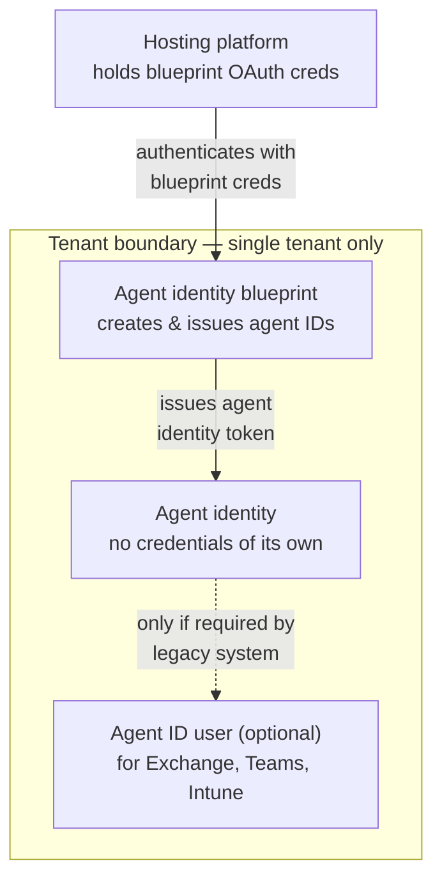

# Microsoft Entra Agent ID

## Table of Contents

- [Introduction](#introduction)
  - [What Are Agent Identities?](#what-are-agent-identities)
  - [What Is Microsoft Entra Agent ID?](#what-is-microsoft-entra-agent-id)
  - [Do AI Agents Use Agent Identities Like Applications Use Service Principals?](#do-ai-agents-use-agent-identities-like-applications-use-service-principals)
- [Comparing Managed Identities, Service Principals, and Agent Identities](#comparing-managed-identities-service-principals-and-agent-identities)
  - [The Quick Comparison](#the-quick-comparison)
  - [Managed Identities: When and What to Use](#managed-identities-when-and-what-to-use)
  - [Service Principals: When and What to Use](#service-principals-when-and-what-to-use)
  - [Agent Identities: When and What to Use](#agent-identities-when-and-what-to-use)
  - [Real-World Decision Framework](#real-world-decision-framework)
- [What Problem Is This Solving?](#what-problem-is-this-solving)
- [Why Agent ID Exists: Benefits and Use Cases](#why-agent-id-exists-benefits-and-use-cases)
  - [Traditional Approaches and Where They Break](#traditional-approaches-and-where-they-break)
  - [Benefits of Agent ID](#benefits-of-agent-id)
  - [Common Use Cases](#common-use-cases)
- [The Two Core Objects](#the-two-core-objects)
- [Trust Chain — How Authentication Actually Flows](#trust-chain--how-authentication-actually-flows)
- [Full Comparison: User vs Service Principal vs Managed Identity vs Agent Identity](#full-comparison-user-vs-service-principal-vs-managed-identity-vs-agent-identity)
- [Agent Identity Blueprints](#agent-identity-blueprints)
- [Where Agents Actually Live (Registries)](#where-agents-actually-live-registries)
- [Types of Agents — Authorization Model](#types-of-agents--authorization-model)
- [Agent ID Portal — What Admins See](#agent-id-portal--what-admins-see)
- [Key Takeaways](#key-takeaways)

---

## Introduction

### What Are Agent Identities?

Agent identities are **special service principals in Microsoft Entra ID** designed specifically for AI agents and autonomous workloads. They represent identity accounts that enable AI agents and other workloads where traditional user accounts and standard application identities prove insufficient.

According to Microsoft's official documentation, agent identities:
- Are distinct from standard Service Principals
- Are purpose-built for autonomous and semi-autonomous AI agents
- Provide a dedicated governance and authentication model
- Enable secure delegation and role-based access without standing credentials

### What Is Microsoft Entra Agent ID?

**Microsoft Entra Agent ID** is Microsoft's identity and access management platform for AI agents. It provides:

1. **A unified identity framework** — Agents get their own dedicated identity class, separate from Users, Service Principals, and Managed Identities
2. **Governance and lifecycle management** — Administrators can manage, monitor, and audit agent identities through a dedicated Agent ID portal
3. **Secure authentication** — Agents authenticate through a Blueprint trust chain, with no standing credentials held by the agent itself
4. **Compliance and risk management** — Built-in features for detecting unmanaged agents, enabling access reviews, and maintaining a complete inventory of all agents in the tenant

Agent ID is the orchestration layer that brings Agent Identities to life in an organization's Entra tenant.

### Do AI Agents Use Agent Identities Like Applications Use Service Principals?

**Yes, but with critical differences.** Here's the relationship:

| Aspect | Application & Service Principal | AI Agent & Agent Identity |
|--------|----------------------------------|---------------------------|
| **What it is** | A registered application in Entra with an associated Service Principal for access control | A special service principal explicitly designed for autonomous/semi-autonomous workloads |
| **Authentication model** | Holds credentials directly (client secret, certificate, or federated identity) | **Never holds credentials** — authenticates via Blueprint trust chain |
| **Authorization pattern** | "The application is the security boundary" | "The agent acts *as* itself OR *on behalf of* a user, with clear separation" |
| **Governance** | Managed as "applications" in Entra; hard to distinguish from other integration points | Managed as *agents* in a dedicated portal; visible as a distinct workload type |
| **Ideal use case** | Service-to-service API calls, webhooks, scheduled integrations | AI agents making decisions, interacting with users, running autonomously, or delegated on user behalf |
| **Comparable layer** | The Service Principal is the identity; the App Registration is the configuration | The Agent Identity is the identity; the Blueprint is the configuration/template |

**The key insight:** A Service Principal is designed for "an application calling an API." An Agent Identity is designed for "something that makes decisions, may act as a user, and needs its own governance lifecycle." They solve different problems, even though Agent Identities are technically a *type* of service principal under the hood.

---

## Comparing Managed Identities, Service Principals, and Agent Identities

If you're learning how organizations use these three identity types, this section is the most important one. These three identity types solve **different problems**, and picking the wrong one wastes time, introduces security gaps, or makes governance a nightmare.

### The Quick Comparison

| Question | Managed Identity | Service Principal | Agent Identity |
|----------|------------------|-------------------|-----------------|
| **What is it?** | Auto-rotated identity tied to an Azure resource | Identity for a registered application or integration | Special service principal for AI agents & autonomous workloads |
| **Who can use it?** | Only Azure resources (VMs, Functions, App Services, etc.) | Any on-premises or cloud app, third-party integrations | AI agents, copilots, autonomous schedulers, orchestrators |
| **Where are credentials stored?** | Azure platform — never visible to you | You manage them (secrets, certs, or federated creds) | Blueprint platform — never held by the agent |
| **Can it act on behalf of a user?** | No | Yes (with On-Behalf-Of flow) | Yes — this is core to its design |
| **How many tenants can it access?** | Only the one it's created in | Can be multi-tenant (but riskier) | Single tenant only — no cross-tenant |
| **Visibility/Governance** | Partial — tied to the resource | Full — visible in App Registrations, Enterprise Apps | Full — dedicated Agent ID portal |
| **Credential rotation** | Automatic, you don't touch it | You handle it (risk if you forget) | Automatic via Blueprint |
| **Best for** | Azure resources calling other Azure services | Traditional API integrations, webhooks, third-party apps | AI making decisions, delegated user actions, autonomous workflows |

**TLDR:** Managed Identity = Azure resources only, zero-credential hassle. Service Principal = traditional integrations, you manage credentials. Agent Identity = AI agents that need to act for users or autonomously without standing secrets.

---

### Managed Identities: When and What to Use

#### What Is It?

A **Managed Identity** is an identity automatically created and managed by Azure for Azure resources. It's like giving a VM, App Service, or Function App its own identity in Entra so it can securely call other Azure services without you ever storing a password or secret.

#### When Would You Use It?

Use a Managed Identity when:

1. **Your workload runs on an Azure resource** — VMs, App Services, Azure Functions, Container Instances, Kubernetes (AKS), Logic Apps, Data Factory, Synapse, etc.
2. **You need to call Azure APIs or services** — Storage accounts, Key Vaults, databases, Azure Resource Manager, Event Hubs, etc.
3. **You want credentials rotated automatically** — no secrets to leak, no "oops, I hardcoded a password" moments
4. **The workload is relatively static** — it's a scheduled job, a microservice in a Function App, a background worker on a VM, not something that needs to act on behalf of users

#### Real Use Cases

- **Azure Function App** calling **Azure Key Vault** to fetch a database password → use Managed Identity
- **VM running a backup job** accessing **Azure Storage** to upload logs → use Managed Identity
- **Data Factory pipeline** accessing **SQL Database** and **Data Lake Storage** → use Managed Identity
- **Kubernetes pod** reading secrets from **Azure Key Vault** → use Managed Identity (Workload Identity)
- **App Service** (your web app) accessing **Cosmos DB** → use Managed Identity

#### Why You'd Pick It Over Service Principal

- **Less operational overhead** — Azure rotates the credential for you automatically
- **No secrets to leak** — there's literally no secret file you could accidentally commit to GitHub
- **Automatically scoped to the resource** — it can only run on *that* VM or Function App, nowhere else
- **Designed for the Azure ecosystem** — if you're all-in on Azure, this is the path of least resistance

#### Why You'd **NOT** Pick It

- **Not available outside Azure** — if your workload runs on-premises or in another cloud, you can't use it
- **Tied to one resource** — if you need the same identity in multiple places, you can't share a Managed Identity between VMs
- **Can't act on behalf of a user** — if you need "the app impersonates a specific user," Managed Identity won't do it

#### Example Scenario

You have an Azure Function that runs every night to clean up old log files in Storage and send a daily report email. You need it to authenticate to both **Storage Account** and **Exchange Online**.

- Use **Managed Identity for Storage** (built-in to the Function, rotated automatically)
- For Exchange, you'd actually need a **Service Principal** (because Exchange isn't part of the Managed Identity's Azure-first design), or you'd route through a Logic App connector

**TLDR:** Managed Identity = the "set it and forget it" identity for Azure resources. Azure handles credential rotation. Use it whenever possible if you're on Azure and don't need to impersonate users.

---

### Service Principals: When and What to Use

#### What Is It?

A **Service Principal** is the identity for an **App Registration** — it's how a *non-human* actor (application, daemon, webhook, integration) authenticates in Entra and gets access to resources.

When you create an App Registration in Entra, a Service Principal is automatically created. The App Registration is the *configuration* (what permissions the app needs), and the Service Principal is the *security principal* (the actual identity that authenticates).

#### When Would You Use It?

Use a Service Principal when:

1. **You have a traditional application** — a .NET web app, Node.js backend, Python script, custom integration
2. **You're integrating third-party SaaS** — Slack, Salesforce, Jira, Datadog, etc. that need to authenticate to your tenant
3. **You need to call Microsoft 365 or Entra APIs** — outside of Azure (PowerShell automation, on-premises tools, cloud integrations)
4. **You need on-behalf-of (OBO) flow** — "the app calls API A on behalf of a signed-in user" (classic OAuth delegation)
5. **You're running on-premises or non-Azure cloud** — your app runs in your data center or on AWS/GCP, and you need it to authenticate to Entra
6. **Multiple deployments need the same identity** — you need the same credentials in Dev, Test, and Prod

#### Real Use Cases

- **A Python script** (on-premises or in another cloud) that queries **Microsoft Graph** to disable inactive accounts → use Service Principal
- **Slack app** integrating with Microsoft Teams → Slack authenticates as a Service Principal in your tenant
- **Third-party security tool** (CrowdStrike, Palo Alto, Okta) reading Azure/Entra data → uses a Service Principal you create for it
- **Custom data pipeline** (Talend, Informatica) copying data from Dynamics 365 to a data warehouse → Service Principal
- **Your team's internal automation** (PowerShell script, GitHub Actions workflow, Jenkins pipeline) making bulk changes in Entra → Service Principal
- **A mobile app** calling your backend API → the backend is a Service Principal
- **Legacy on-premises app** needing to validate users against Entra → Service Principal

#### Why You'd Pick It Over Managed Identity

- **Works anywhere** — on-premises, AWS, GCP, containers, laptops — no Azure lockdown
- **Shared across environments** — you can use the same Service Principal credentials in Dev, Test, and Prod
- **Supports OBO flow** — if you need "the app acts on behalf of a user," Service Principal is the standard
- **Broad third-party support** — Okta, Slack, Datadog, etc. all know how to work with Service Principals

#### Why You'd **NOT** Pick It

- **You have to manage credentials** — you either store a client secret (which can leak), manage certificates (which can expire), or set up federated identity credentials (more complex but better)
- **More operational overhead** — you need to rotate secrets, track expiry, audit usage
- **Harder to govern at scale** — if you have 500+ Service Principals, auditing and cleaning up "which ones are still used?" is painful
- **Potential for privilege creep** — if you're not careful, a Service Principal gets more permissions than it needs, and it sits there for 3 years with admin access nobody remembers it has

#### Example Scenario

You're a Microsoft partner using Power Automate to pull data from a customer's Entra tenant, process it, and write results back to SharePoint. You need a way to authenticate.

- You **create an App Registration** in the customer's tenant
- The App Registration's Service Principal is what authenticates
- You store the Service Principal's credentials securely in your systems
- Power Automate uses those credentials to authenticate as the Service Principal
- Power Automate calls Microsoft Graph APIs with the Service Principal's permissions

**TLDR:** Service Principal = the identity for traditional apps, integrations, and on-premises tools. You manage the credentials (secret, cert, or federated). Use it when Managed Identity won't work or when you need to support OBO flow.

---

### Agent Identities: When and What to Use

#### What Is It?

An **Agent Identity** is a **special service principal** designed specifically for AI agents and autonomous workloads. Unlike a regular Service Principal (which is designed for "an app calling an API"), an Agent Identity is designed for "an autonomous agent that makes decisions, may impersonate users, and needs its own governance lifecycle."

The key difference: **the Agent Identity never holds the credential.** Instead, it's created and managed by a **Blueprint** (a parent platform/service), and that Blueprint authenticates on the agent's behalf. The agent itself is credentialless.

#### When Would You Use It?

Use an Agent Identity when:

1. **You have an AI agent or copilot** — something making decisions, chatting with users, summarizing data
2. **The agent acts on behalf of users** — "the agent reads *the user's* email and drafts a reply" (Interactive agent)
3. **The agent acts autonomously** — "the agent monitors logs, correlates alerts, opens tickets without human intervention" (Autonomous agent)
4. **The agent runs on a schedule or learns over time** — "every hour, check posture; every month, do a compliance audit" (Instantiated agent)
5. **You need to detect/govern all agents in the tenant** — the Agent ID portal gives you a unified view
6. **The agent needs to impersonate users** — not just call APIs, but act *as* specific users
7. **You want to avoid Managed Identity or Service Principal hacks** — building an agent on a "fake user account" or a generic Service Principal is now an anti-pattern

#### Real Use Cases

- **Microsoft Copilot in Microsoft 365** — summarizing emails, suggesting next actions, drafting replies on behalf of the user → Interactive Agent Identity
- **In-house security automation agent** — queries logs, correlates alerts, opens tickets in ServiceNow, escalates to on-call → Autonomous Agent Identity
- **Compliance monitoring agent** — runs weekly, checks all groups for MFA, audits admin access, reports findings → Instantiated Agent Identity
- **Agent orchestrator** — a planner agent that breaks down a request and calls specialist agents to execute → uses incoming tokens to call other Agent Identities
- **Triage agent** — receives emails, routes to teams, sends Teams messages, needs a mailbox and Teams presence → Agent Identity + Agent ID User
- **Internal IT bot** — answers questions about company policy, creates tickets, resets passwords for users who request it → Interactive Agent Identity
- **Your organization's AI research agent** — fine-tunes on internal data, learns from user feedback, represents a research team — Instantiated Agent Identity

#### Why You'd Pick It Over Service Principal or Managed Identity

- **No standing credentials** — the agent doesn't hold a secret; compromising it requires compromising the hosting platform, not just finding a leaked credential
- **Purpose-built for AI** — designed from the ground up for agents that make decisions, impersonate users, and run continuously
- **Unified governance** — dedicated Agent ID portal, Unmanaged Agents detection, compliance-ready
- **Clean user delegation** — the `azp`/actor claim clearly shows "the agent acted for this user" vs. "the agent acted as itself"
- **Tenant-isolated by design** — can't accidentally get cross-tenant tokens like a misconfigured Service Principal can
- **Avoid the "fake user" trap** — you're not creating a fake employee account and trying to govern it with HR tools
- **Supports agent-to-agent patterns** — orchestrators can call specialists; incoming tokens are first-class

#### Why You'd **NOT** Pick It

- **Agent Identities are new** — not all systems support them yet; you might still need a Service Principal or fake user for legacy integrations
- **Requires a Blueprint** — the hosting platform has to support it (e.g., Azure Bot Service, Microsoft Copilot stack)
- **Still evolving** — governance tooling and best practices are still being refined
- **Not for traditional applications** — if it's not an AI agent making decisions, you don't need it; use Service Principal or Managed Identity instead

#### Example Scenario

Your organization is building an internal IT support agent. When an employee asks "help me reset my password," the agent:
- Authenticates as an Agent Identity (never using a human password or leaked secret)
- Acts on behalf of the user (delegated token with the user's identity + agent's actor claim)
- Calls into Entra to verify the user's identity (challenge-response, security questions, MFA)
- On approval, delegates to the actual password reset process
- Logs all actions with the user + agent clearly distinguished

If you tried this with a **Service Principal**, you'd have one identity trying to impersonate multiple users without a clean audit trail of "who did what on behalf of whom."

If you tried this with a **Managed Identity**, you'd be limited to Azure resources and couldn't interact with Exchange, Teams, or users' mailboxes.

With an **Agent Identity**, it's built in: the `azp`/actor claim shows the agent, the subject shows the user, and governance is a dedicated Agent ID portal tile.

**TLDR:** Agent Identity = the identity for AI agents, copilots, and autonomous workloads. The agent itself holds no credentials (the Blueprint does). Use it when you're building AI agents that need to act for users, run autonomously, or need governance separate from regular apps.

---

### Real-World Decision Framework

**Use this flowchart when you're deciding which identity to use:**

```
START: I need an identity for my workload

├─ Is my workload an AZURE RESOURCE (VM, Function App, App Service, Container, etc.)?
│  ├─ YES → Do you need to call OTHER AZURE SERVICES (Storage, Key Vault, SQL, etc.)?
│  │  ├─ YES → USE MANAGED IDENTITY ✓
│  │  └─ NO → Use Service Principal or Agent Identity (if it's an AI agent)
│  │
│  └─ NO → Continue below
│
├─ Is my workload an AI AGENT, COPILOT, or AUTONOMOUS SCHEDULER?
│  ├─ YES → Does it need to act ON BEHALF OF USERS or make autonomous decisions?
│  │  ├─ YES (and supported by your platform) → USE AGENT IDENTITY ✓
│  │  └─ NO (or legacy system) → Fallback to Service Principal
│  │
│  └─ NO → Continue below
│
├─ Is my workload a TRADITIONAL APP or INTEGRATION (on-premises, cloud, third-party SaaS)?
│  ├─ YES → USE SERVICE PRINCIPAL ✓
│  │
│  └─ NO → Continue below
│
└─ UNCLEAR? Default to SERVICE PRINCIPAL (most flexible, works everywhere)
```

---

## What Problem Is This Solving?

Before Agent ID, an AI agent's identity in Entra had to be bolted onto existing object types — usually a **Service Principal** (via an App Registration) or, in hacky cases, a real **User account**.

Both approaches were wrong-shaped for the job:

- **App Registration / Service Principal** → fine for "an application calling an API," but never designed for "something that acts semi-autonomously on a schedule, makes decisions, and might need user-delegated permissions or a mailbox."
- **A fake user account** → gets you into Exchange/Teams/Intune, but now you're governing an AI workload with the same lifecycle tooling you use for humans, which is a mess for access reviews, credential rotation, and compliance.

**Agent ID is Microsoft creating a fourth identity category** — distinct from Users, Service Principals, and Managed Identities — purpose-built so admins can govern AI agents with their own policies, audit trails, and lifecycle.

**TLDR:** Before Agent ID, organizations had to hack AI agents onto Service Principals (designed for APIs) or fake user accounts (designed for humans). Agent ID is the proper fix — a dedicated identity class for AI.

---

## Why Agent ID Exists: Benefits and Use Cases

### Traditional Approaches and Where They Break

Before Agent ID, teams stitched together AI agent identity from objects that weren't built for it:

| Traditional approach | What it gets you | Where it breaks down |
|---|---|---|
| **App Registration / Service Principal** | Standard auth, API access, familiar governance tooling | No native "act as user" story without manual OBO config; secrets/certs need rotation and can leak; agent gets mixed into generic "application" counts |
| **Fake user account created for the agent** | Gets into Exchange/Teams/Intune, looks "normal" to legacy systems | Now governed by human-lifecycle tooling — access reviews, conditional access policies, and MFA prompts don't make sense for a workload |
| **Managed Identity** | No credentials to manage, platform-rotated | Tightly bound to a single Azure resource; can't act as a user/actor in a delegated flow; doesn't generalize to non-Azure-hosted agents |
| **Ad hoc combination of the above** | "Works" | No unified inventory — you end up hunting across App Registrations, fake users, and Managed Identities just to answer "what AI agents exist in the tenant?" |

The common thread: **every traditional option forces an AI agent to pretend to be something it isn't** — either a human or a generic application — which means it inherits that thing's governance model, even when that model doesn't fit.

**TLDR:** Every pre-Agent ID approach was a workaround. Service Principals are for apps, Managed Identities are for Azure resources, fake users are for humans. None of them were designed for AI agents.

---

### Benefits of Agent ID

- **Dedicated governance surface** — agents get their own portal, their own lifecycle, their own policies, instead of hiding inside user or app counts where they're invisible to standard reviews.
- **No standing credentials to steal** — the Agent Identity itself never holds a secret; compromising it requires compromising the hosting platform's Blueprint trust chain, not just finding a leaked credential.
- **Clean actor/subject separation** — the `azp`/actor claim cleanly distinguishes "the agent acted for itself" from "the agent acted for a user," which is exactly the distinction you need for audit and IR work.
- **Tenant isolation enforced by design** — Agent Identities cannot get cross-tenant tokens at all, removing a whole class of multi-tenant app misconfiguration risk.
- **Built-in orphan/shadow detection** — the Agent ID Portal's Unmanaged Agents and No Identities tiles, plus EAR's tenant scanning, give you a standing inventory check that doesn't exist for "fake users" or generic Service Principals.
- **Supports both delegated and autonomous patterns natively** — Interactive (user-delegated), Autonomous, and Instantiated agent types are first-class concepts instead of something you bolt onto an existing identity type.
- **Legacy compatibility without full user overhead** — the optional Agent ID User gives you the mailbox/Teams/Intune access you'd otherwise fake with a real user account, but it's explicitly tied to the Agent Identity and governed separately.

**TLDR:** Agent ID gives AI agents their own identity class, zero standing credentials, clean audit trails, and a dedicated governance surface.

---

### Common Use Cases

- **SOC/IR automation agents** — an agent that autonomously queries logs, correlates alerts, and opens tickets fits the Autonomous pattern: its own grant, no human in the loop, clean separation from human operators for audit.
- **Copilot-style assistants acting for a user** — "summarize my inbox and draft a reply" is the Interactive pattern: the agent acts as the user, using the user's own permissions, with the actor claim showing it was the agent doing the work.
- **Scheduled compliance/posture-monitoring agents** — a continuously-running checker (conceptually similar to what your CrowdStrike CSPM integration does) maps to the Instantiated pattern: provisioned access, running on a schedule, learning-driven.
- **Agent-to-agent orchestration** — one agent calling another (a planner agent dispatching to a specialist agent) uses the "incoming token" pattern, where the receiving Agent Identity is the audience.
- **Agents that need a mailbox or Teams presence** — e.g., a triage agent that needs to send/receive email or post in a Teams channel — this is exactly what the Agent ID User object exists for.

**TLDR:** SOC automation, user copilots, compliance bots, agent orchestrators, and agents needing mailboxes are the killer use cases for Agent Identity.

---

## The Two Core Objects

### 1. Agent Identity (the primary account)

This is the actual identity the agent authenticates as. Key properties:

| Property | Detail |
|---|---|
| Identifiers | Object ID and App ID — **always identical** (this is new; SPs normally have different object IDs per tenant from a shared App ID) |
| Credentials | **None.** No password, no client secret, no cert directly on the object |
| How it authenticates | By presenting a token issued to the *platform/service hosting it* — auth is delegated up to the Blueprint |
| Tenant scope | Can only get tokens in the tenant where it was created — no cross-tenant tokens, period |

Three token patterns it can be involved in:

- **Agent token** — Agent Identity is the *subject*. Pure machine-to-machine, like a Service Principal calling Graph.
- **Incoming token** — Agent Identity is the *audience*. Someone else (another agent, a client) calls it.
- **User-delegated token** — *subject* is a human user, but the *actor* (`azp`/`appId` claim) is the Agent Identity. This is the interesting one — it's structurally identical to OBO (on-behalf-of) flow, and this is where the distinction from a Service Principal really matters.

> **For security and compliance work:** that `azp`/actor-claim pattern is the same mechanism worth checking in token inspection during IR — if you ever need to determine "did the agent act *as* the user or *for* the user," the actor claim tells you.

**TLDR:** Agent Identity = the credentialless security principal. It gets tokens from the Blueprint, never holds a secret, and can be involved in three token patterns: agent-to-machine, incoming, or user-delegated.

---

### 2. Agent ID User (the secondary, optional account)

This exists **only** to satisfy systems that hard-require a user object — Exchange mailboxes, M365/Teams groups, Intune RBAC. Things that simply won't accept a Service-Principal-shaped identity.

- It's a real user object (UPN, manager, photo — the works)
- Always tied 1:1 to a parent Agent Identity
- Has its own separate Object ID from the Agent Identity
- **Cannot authenticate on its own** — it can only be used via a token issued to its parent Agent Identity
- Requires elevated authorization on the Blueprint/creating service to provision (this is a privileged action — flag it)

Think of the Agent Identity as the actual *security principal*, and the Agent ID User as a **compatibility shim** so legacy user-shaped systems will talk to it.

**TLDR:** Agent ID User = an optional real user object attached to an Agent Identity for systems that absolutely need a user (mailbox, Teams). It can't authenticate on its own; it's just a shim.

---

## Trust Chain — How Authentication Actually Flows

The part that trips people up coming from App Registrations / Managed Identities: an Agent Identity is **always two hops removed** from anything that can authenticate on its own. It never holds a credential directly.


```mermaid
flowchart TD
    A["Hosting platform<br/>holds blueprint OAuth creds"] -->|"authenticates with<br/>blueprint creds"| B
    subgraph TENANT["Tenant boundary — single tenant only"]
        B["Agent identity blueprint<br/>creates & issues agent IDs"] -->|"issues agent<br/>identity token"| C["Agent identity<br/>no credentials of its own"]
        C -.->|"only if required by<br/>legacy system"| D["Agent ID user (optional)<br/>for Exchange, Teams, Intune"]
    end
```

Two distinct trust hops:
1. **Hosting platform → Blueprint** — the platform running the agent authenticates using the *Blueprint's* OAuth credentials (secret, cert, or federated identity credential like a managed identity).
2. **Blueprint → Agent Identity** — the Blueprint then mints a token *as* the Agent Identity. The Agent Identity itself never directly authenticates with anything.

The **Agent ID User** branch is dashed because it's conditional — it only gets provisioned when the agent needs to touch a system that hard-requires a user object (mailbox, Teams membership, Intune enrollment).

**TLDR:** Authentication is always two hops: Hosting Platform (holds the real credential) → Blueprint → Agent Identity (never holds a credential). The Agent ID User is an optional third branch for legacy systems.

---

## Full Comparison: User vs Service Principal vs Managed Identity vs Agent Identity

| | User | Service Principal | Managed Identity | **Agent Identity** |
|---|---|---|---|---|
| Credential | Password / MFA | Secret, cert, or federated cred | None — platform-rotated | **None — borrows the host's token** |
| Object ID vs App ID | N/A (no App ID) | Different per tenant | N/A (no App ID) | **Always identical** |
| Tied to | A person | An App Registration | One Azure resource (VM, Function App, etc.) | **A Blueprint + hosting platform** |
| Can act as a user (OBO-style actor) | N/A | Yes, if configured | No | **Yes — this is core to its design** |
| Cross-tenant capable | No | Yes, if multi-tenant app | No | **Never** |
| Created/destroyed by | HR sync / admin | App registration process | Azure resource lifecycle | **Blueprint (privileged action)** |
| Visible permissions in portal | Yes | Yes — API permissions blade | Partial | **No — Microsoft-managed, invisible by design** |
| Has a "legacy compatibility" twin object | — | — | — | **Yes — Agent ID User, only if needed for Exchange/Teams/Intune** |

**The distinction that actually matters:** 
- Managed Identity solves "no credentials to leak" for a single resource calling Azure APIs. 
- Service Principal solves "service-to-service auth" for apps that live anywhere. 
- Agent Identity solves "no credentials to leak" **and** "I need to act on behalf of users, run autonomously, and be governed as a distinct workload type."

The permissions-visibility row is the one that'll trip people up during security audits: **Agent ID permissions are Microsoft-managed and preauthorized — they will not appear under API Permissions in the portal.**

**TLDR:** Users are people. Service Principals are apps/integrations (you manage credentials). Managed Identities are Azure resources (Azure manages credentials). Agent Identities are AI agents (Blueprint manages credentials, agent acts for users or autonomously).

---

## Agent Identity Blueprints

The Blueprint is the parent/template, and it does three jobs at once:

1. **Defines the "type"** of agent (e.g., "Sales Agent," "Monitoring Agent") and holds shared metadata/role definitions across every instance of that type.
2. **Creates Agent Identities** — the Blueprint itself has OAuth credentials (client secrets, certs, federated identity credentials like managed identities) it uses to authenticate to Entra and issue tokens to Agent Identities under its umbrella.
3. **Used at runtime by the hosting platform** — the service running the agent uses the Blueprint's OAuth credentials to get a token, then exchanges that for a token *as* one of its Agent Identities.

> Pattern recognition: this is structurally similar to how a CSPM-style integration uses **one privileged Service Principal as a Tier 0 credential to provision/manage downstream access** for read-only scanners across subscriptions.

**TLDR:** Blueprint = the parent template that holds the real credential. It creates Agent Identities and issues them tokens at runtime. Organizationally, it's like a "managed" service principal for creating AI agents.

---

## Where Agents Actually Live (Registries)

Three separate registries, not one unified store:

| Registry | Covers |
|---|---|
| **MOS** (M365 Onboarding Service) | Older third-party agents + Declarative Agents |
| **AOS** (A365 Onboarding Service) | Newer 1P/3P agents using Agent Identities, full instantiated-agent scenarios |
| **EAR** (Entra Agent Registry) | All agents *with* Agent Identities — both self-registered and ones discovered via tenant scanning for unsecured/shadow agents |

That last bit — **tenant scanning for unsecured agents** — is worth flagging for security work. It implies Entra is doing the equivalent of shadow-IT discovery, but for agents. That means "unknown AI workloads running in your tenant" should be treated as a finding.

**TLDR:** Agents can be registered in MOS (older), AOS (newer), or EAR (all Agent Identities + shadow discovery). If you see an agent you don't recognize, that's a governance gap.

---

## Types of Agents — Authorization Model

This is the part that actually matters for threat modeling, because it determines **whose permissions get used:**

| Type | Acts on behalf of | Authorization source | Token type |
|---|---|---|---|
| **Interactive** | The user, in response to a prompt | User's own permissions | User token (with agent as actor) |
| **Autonomous** | Itself, no human in the loop | Agent's own grants | Agent token / Agent user token |
| **Instantiated** | Itself, on its own schedule/goals, learning-driven | Provisioned access, no per-action human auth | Agent token / Agent user token |

The Interactive vs. Autonomous distinction is your blast-radius question during IR: an Interactive Agent compromise is bounded by what the *signed-in user* could do; an Autonomous or Instantiated Agent compromise is bounded by what the *agent itself* was granted — potentially broader and more persistent.

**TLDR:** Interactive agents act for users (bounded by user permissions). Autonomous/Instantiated agents act for themselves (bounded by agent permissions). Interactive = smaller blast radius in IR. Autonomous = watch what permissions you grant it.

---

## Agent ID Portal — What Admins See

- **Recently Created Agents** — last 30 days
- **Unmanaged Agents** — no owner or sponsor assigned (governance gap, watch this tile)
- **Active Agents** — currently enabled for access
- **No Identities** — agents that exist (e.g., third-party via OpenID) but have no Agent ID tied to them — a visibility gap by definition
- **Types of Agents** — breakdown across Agent Identity (no user) / Agent Identity (with user) / agents riding on Service Principals / agents with no identity at all
- **Agent Blueprints** — published blueprints, drill-down available from this tile or the full Agent Blueprints blade

The **Unmanaged Agents** and **No Identities** tiles are the two I'd treat as standing detection/governance checks — they're the direct analogs of unmanaged service principals or orphaned Azure resources.

**TLDR:** Agent ID Portal = your single source of truth for all agents. Watch the "Unmanaged Agents" and "No Identities" tiles like you watch for orphaned Service Principals.

---

## Key Takeaways

> **Agent Identity** is Microsoft Entra's answer to this question: "How do we give AI agents a dedicated identity class that supports both autonomous and user-delegated patterns, holds no credentials, and can be governed separately from users and regular applications?"

**Core principles:**

1. **Agent Identities are special service principals** — purpose-built for autonomous and semi-autonomous workloads, not general-purpose integrations.
2. **They never hold credentials** — they authenticate through a Blueprint that holds the actual OAuth credentials.
3. **They support three token patterns** — agent tokens (machine-to-machine), incoming tokens (someone calling the agent), and user-delegated tokens (agent acting for a user).
4. **Governance is separate and visible** — Unmanaged Agents, No Identities, and the Agent ID portal give admins a dedicated view into agent inventory and risk.
5. **AI agents use Agent Identities like applications use Service Principals** — but Agent Identities are specifically designed for autonomous decision-making and user delegation, whereas Service Principals are designed for service-to-service API calls.

**Quick decision guide for your learning:**

- Need an Azure resource to call Azure services? → **Managed Identity**
- Need a traditional app or on-premises tool to authenticate? → **Service Principal**
- Need an AI agent that makes decisions or acts for users? → **Agent Identity**
- Unsure? → **Service Principal** (most flexible, works everywhere)

---

## References

- [What Are Agent Identities - Microsoft Learn](https://learn.microsoft.com/en-us/entra/agent-id/what-are-agent-identities)
- [What Is Microsoft Entra Agent ID - Microsoft Learn](https://learn.microsoft.com/en-us/entra/agent-id/what-is-microsoft-entra-agent-id)
- [Agent Identities - Microsoft Learn](https://learn.microsoft.com/en-us/entra/agent-id/agent-identities)
